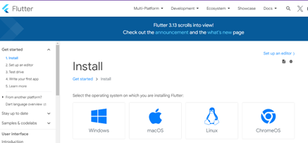

1-	Flutter Kurulumu

  Öncelikle https://docs.flutter.dev/get-started/install adresinden kendi sisteminize uygun paketi seçip indirmelisiniz. 

  Burada Windows işletim sistemi için kurulum anlatılacak. İndirme seçeneklerinden Windows’u seçtiğinizde Flutter’ı indirmek için git ve manual olmak üzere 2 yöntem karşınıza çıkar. Manual kurulumda karşınıza gelen ekranda bir adet indirilebilir zip paketi vardır. Bu paket bilgisayarımıza indirilir.

  Gerekli olan Flutter SDK paketini indirdikten sonra Flutter, bizden bu paketi bilgisayarımız içinde bir klasöre çıkarmamızı istiyor. Flutter’ın bulunacağı dizin ve dizin yolunda özel karakterler, boşluk ve Türkçe karakterler bulunmamalıdır. Ayrıca “C:\Program Files\ “ özel izin gerektirebilecek klasörler de Flutter SDK’sı için kullanılmamalıdır.

  Bunun için genel olarak “C:\src\fluter” yolu kullanılır. C’nin içinde “src” isimli bir klasör oluşturup indirdiğiniz Flutter klasörünü bunun içine çıkartınız.

  Flutter SDK’sını “C:\src\flutter” içine çıkardıktan sonra Flutter komutlarının sistemimizde çalışması sistemimizin ortam değişkenlerinde işlem yapılmalıdır. Bunun için Windows Ortam Değişkenleri ekranı açılır ve burada bulunan Kullanıcı Değişkenleri bölümünde bulunan Path içine “C:\src\flutter\bin” klasörü eklenir.

  Bunun için Windows’ta Başlat menüsündeki Arama Çubuğuna “Ortam” yazdığınızda karşınıza çıkan Kullanıcı Hesabı için Ortam Değişkenlerini Düzenle seçeneği seçilir. Açılan pencerede Kullanıcı değişkenleri bölümündeki Path seçeneğinde gerekli işlem yapılır.

