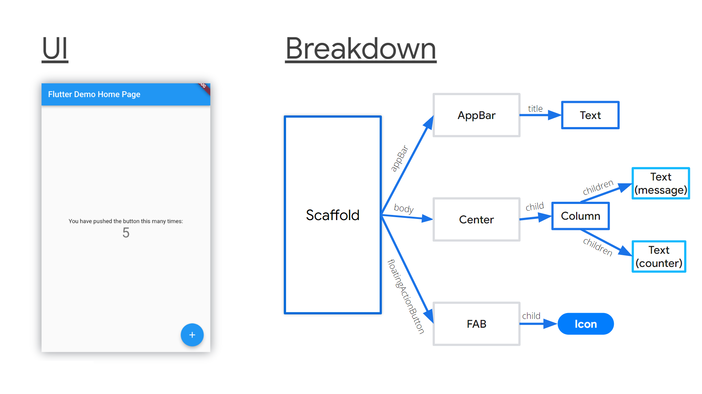
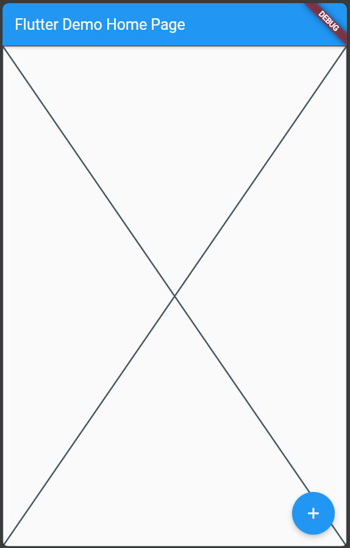

# Scaffold

  Scaffold, mobil uygulamalarda bulunan nesnelerin ekran üzerinde yerleşimi için onlara bir iskelet yapısı sunar. Ekranın aynı iskelet yapısı gibi bölümlere ayırır ve, istediğiniz alana widget'ınızı eklemenizi sağlar. 



  Örneğin uygulamnızın en üstünde bir banner yerleştirmek istediğinizde, banner için gerekli nesnenin büyüklük, konum, stil gibi özelliklerini ve diğer nesnlerle etkileşimini en baştan yapmak tasarlamak ve kodlamak yerine scffold widget'ının appbar özellğini kullanabilirz.

````
//main.dart
import 'package:flutter/material.dart';

void main() {
  runApp(const MyApp());
}

class MyApp extends StatelessWidget {
  const MyApp({super.key});

  // This widget is the root of your application.
  @override
  Widget build(BuildContext context) {
    return MaterialApp(
      title: 'Flutter Demo',
      theme: ThemeData(
        primarySwatch: Colors.blue,
      ),
      home: Scaffold(
        appBar: AppBar(
          title: const Text('Flutter Demo Home Page'),
        ),
        body: const Center(
          child: Placeholder(),
        ),
        floatingActionButton: FloatingActionButton(
          onPressed: () {},
          tooltip: 'Increment',
          child: const Icon(Icons.add),
        ),
      ),
    );
  }
}

````

