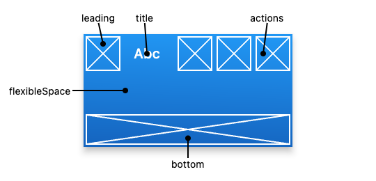

# AppBar

  Bu widget mobil uygulamalrınızda banner özelliği görmektededir. Uygulama ismi ve logosu gibi nesneler bu bölümde yer alabilir.

  

  AppBar widget'ı Scaffold widgetının appbar özelliğine atayarak kullanabiliriz.

````
home: Scaffold(
        appBar: AppBar(
          title: const Text('Flutter Demo Home Page'),
        ),
````


## AppBar Özellikleri


````
//main.dart

import 'package:flutter/material.dart';

void main() {
  runApp(const MyApp());
}

class MyApp extends StatelessWidget {
  const MyApp({super.key});

  // This widget is the root of your application.
  @override
  Widget build(BuildContext context) {
    return MaterialApp(
      title: 'Flutter Demo',
      debugShowCheckedModeBanner: false,
      theme: ThemeData(
        primarySwatch: Colors.blue,
      ),
      home: Scaffold(
        appBar: AppBar(
          title: const Text('Flutter Demo Home Page'),
          backgroundColor: Colors.amberAccent,
          foregroundColor: Colors.red,
          leading: const Icon(Icons.menu),
          actions: const [Icon(Icons.add), Icon(Icons.delete)],
        ),
        body: const Center(
          child: Placeholder(),
        ),
        floatingActionButton: FloatingActionButton(
          onPressed: () {},
          tooltip: 'Increment',
          child: const Icon(Icons.add),
        ),
      ),
    );
  }
}

````


